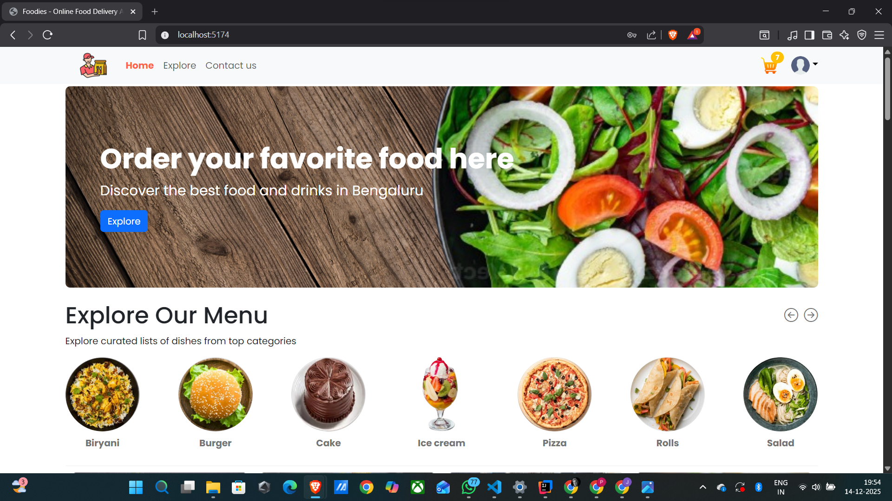
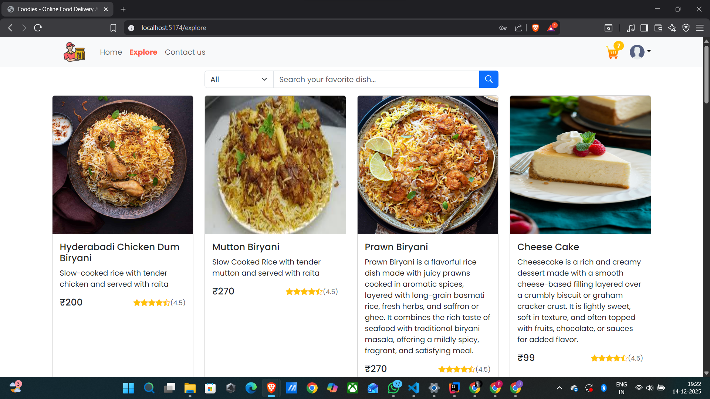
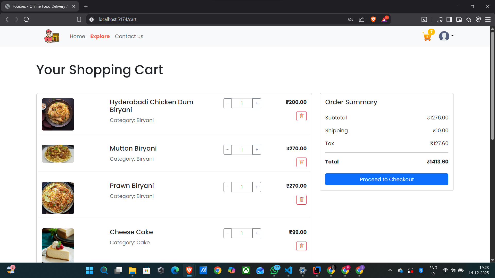
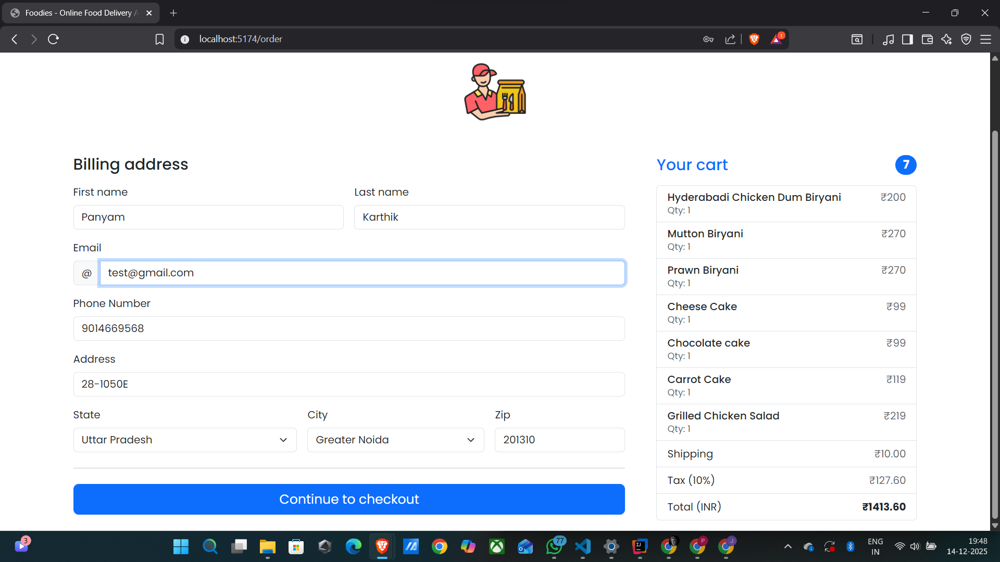
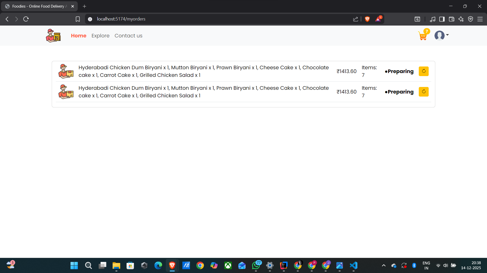
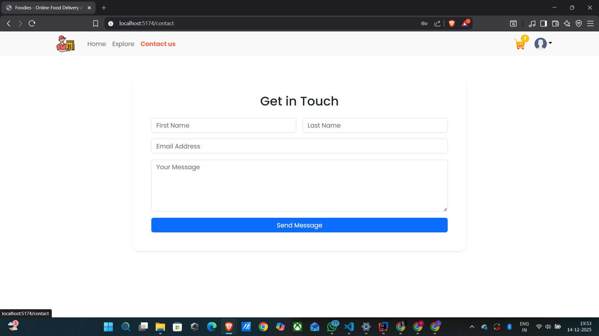
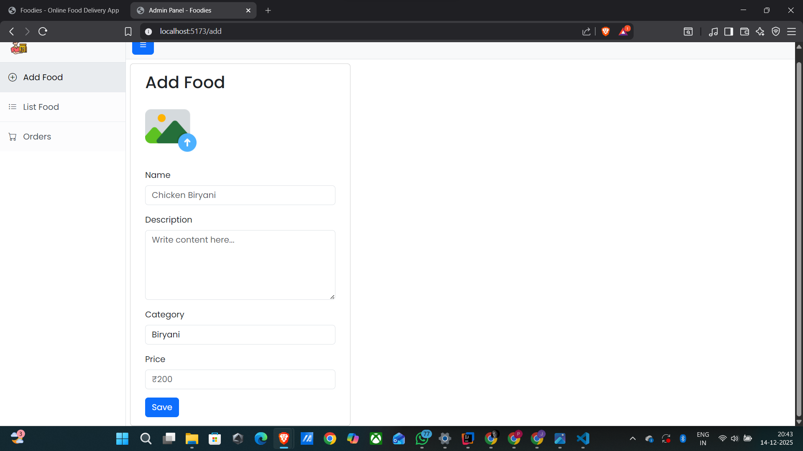
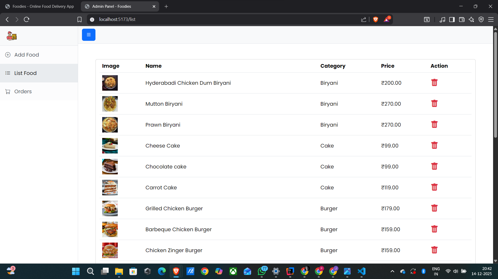
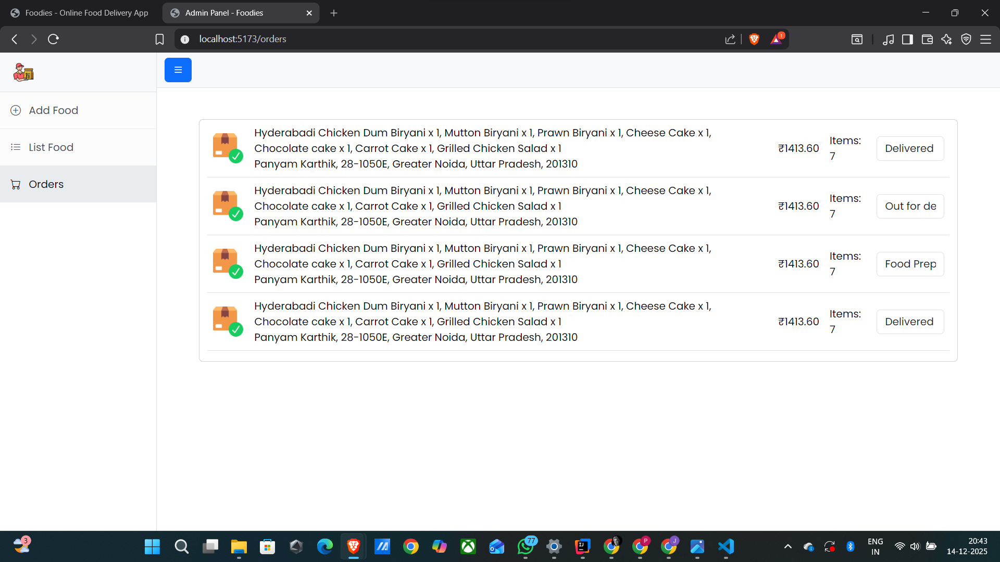

# 🍽️ Foodies – Online Food Ordering Application

Foodies is a **full‑stack online food ordering application** with separate **User** and **Admin** modules. It allows customers to explore food items, add them to the cart, place orders, make payments using **Razorpay (Test Mode)**, and track order status. Admins can manage food items and handle order lifecycle updates.

---

## 🚀 Features

### 👤 User Module

* Browse food categories on the Home page
* Explore all food items with search & category filter
* Add items to cart and manage quantity
* Checkout with delivery address
* Online payment integration using **Razorpay (Test Mode)**
* View order history
* Track order status (Preparing → Out for Delivery → Delivered)
* Contact Us form for user queries

### 🛠️ Admin Module

* Add new food items (with image upload)
* View all food items
* Delete food items
* View customer orders
* Update order status:

  * Food Preparing
  * Out for Delivery
  * Delivered

---

## 🖼️ Application Screenshots

### 👤 User Module Screenshots

**Home Page**



**Explore Page**



**Cart Page**



**Checkout Page**



**My Orders Page**



**Contact Us Page**



---

### 🛠️ Admin Module Screenshots

**Add Food Item**



**List Food Items**



**Orders Management**



---

## 🧰 Tech Stack

### Frontend (User & Admin)

* **React** (Vite)
* **React Router DOM**
* **Bootstrap & Bootstrap Icons**
* **Axios**
* **React Toastify**
* **Razorpay Checkout** (User module)

### Backend

* **Spring Boot 3.4.12**
* **Java 21**
* **MongoDB**
* **Spring Security & JWT Authentication**
* **AWS S3** (Image Storage)
* **Razorpay Java SDK**


## ⚙️ Backend Setup (Spring Boot)

### Prerequisites

* Java 21
* Maven
* MongoDB (Local or Atlas)

### Steps

```bash
cd backend
mvn clean install
mvn spring-boot:run
```

### Backend Runs On

```
http://localhost:8080
```

---

## ⚙️ Admin Panel Setup

```bash
cd admin-panel
npm install
npm run dev
```

Admin Panel Runs On:

```
http://localhost:5173
```

---

## ⚙️ User Frontend Setup

```bash
cd user-frontend
npm install
npm run dev
```

User Application Runs On:

```
http://localhost:5174
```

---

## 💳 Razorpay Integration

* Razorpay is integrated in **Test Mode**
* Payment is triggered during checkout
* Orders are confirmed after successful payment

---

## 🔐 Security

* JWT‑based authentication
* Secure API endpoints using Spring Security

---

## 🗄️ Database

* **MongoDB** used for:

  * Users
  * Food Items
  * Orders

---

## ☁️ AWS Integration

* **AWS S3** used to store food images uploaded by admin

---

## 🧪 Testing

```bash
mvn test
```

---

## 📌 Future Enhancements

* Role‑based authentication (Admin/User)
* Order cancellation & refunds
* Real‑time order tracking
* Email & SMS notifications
* Admin analytics dashboard

---

## 👨‍💻 Author

**Panyam Karthikeya**

---

## 📄 License

This project is for learning and demonstration purposes.

---

⭐ If you like this project, consider giving it a star on GitHub!
